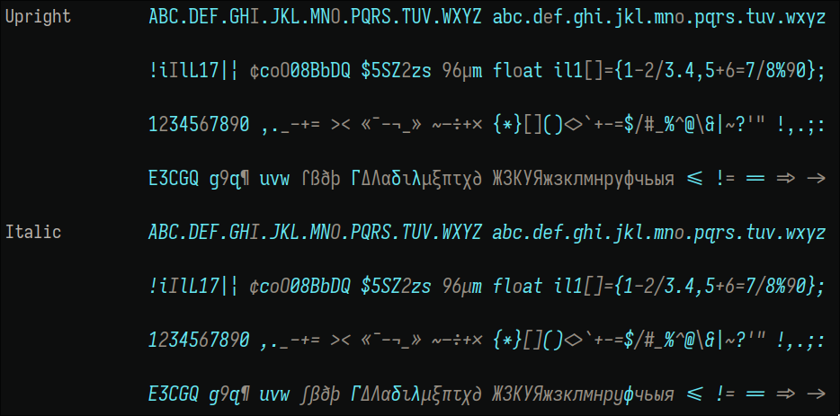

# Fonts

## Iosevka0828

Iosevka custom font with slab serifs.


Note: **Iosevka0828 has ligature for `!=`**

### Build

* See how Iosevka0828 looks like:
  * Import config file iosevka-slab-ss08-0828.toml on [Iosevka Customizer](https://typeof.net/Iosevka/customizer).

1. Copy contents in iosevka-slab-ss08-0828.toml to private-build-plans.toml file in the Iosevka git repo.
2. Start build:
   * run `npm run build -- contents::iosevka0828` for TTF and Web fonts.
   * run `npm run build -- ttf::iosevka0828` for TTF fonts.

### Patching Nerd Fonts

* Use font patcher from [nerd fonts](https://github.com/ryanoasis/nerd-fonts/):

  ``` bash
  # CAUTION: CPU usage 100%
  for f in `find iosevka0828_20230729 -type f`; do ./fontpatcher/font-patcher $f --complete --quiet --mono --makegroups --outputdir ./iosevka0828NF_mono_groups_v3 &; done; wait
  ```

### Compatibility

Compatible with Iosevka 25.1.1

## Iosevka1204

Iosevka custom font with sans and little serif tails.



Note: **Iosevka1204 has ligature for `!=`**

* See how Iosevka1204 looks like:
  * Import config file iosevka-sans-default-1204.toml on [Iosevka Customizer](https://typeof.net/Iosevka/customizer).

1. Copy contents in iosevka-sans-default-1204.toml to private-build-plans.toml file in the Iosevka git repo.
2. Start build:
   * run `npm run build -- contents::iosevka1204` for TTF and Web fonts.
   * run `npm run build -- ttf::iosevka1204` for TTF fonts.

### Patching Nerd Fonts

* Use font patcher from [nerd fonts](https://github.com/ryanoasis/nerd-fonts/):

  ``` bash
  # CAUTION: CPU usage 100%
  for f in `find Iosevka1204_20240613/TTF-Extend -type f`; do ./fontpatcher/font-patcher $f --complete --quiet --mono --makegroups --outputdir ./Iosevka1204NFM_20240613 &; done; wait
  ```

#### To patch on Windows

With nushell, similar with powershel

```nu
# Install fontforge
scoop install fontforge
# Unzip and enter fontpatcher
cd font-patcher
mkdir ttf ttf_patched
# Preapre unpatched fonts
cp *.ttf ttf
# Do the patch
ls ttf | get name | each {|x| fontforge -script font-patcher $x --complete --quiet --mono --makegroups --outputdir ttf_patched}
```

### Compatibility

Latest update: 2024.10.09

Compatible with Iosevka 31.8.0
